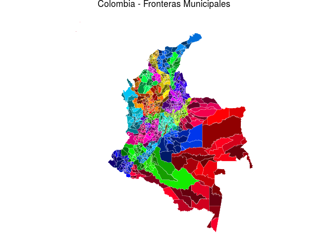
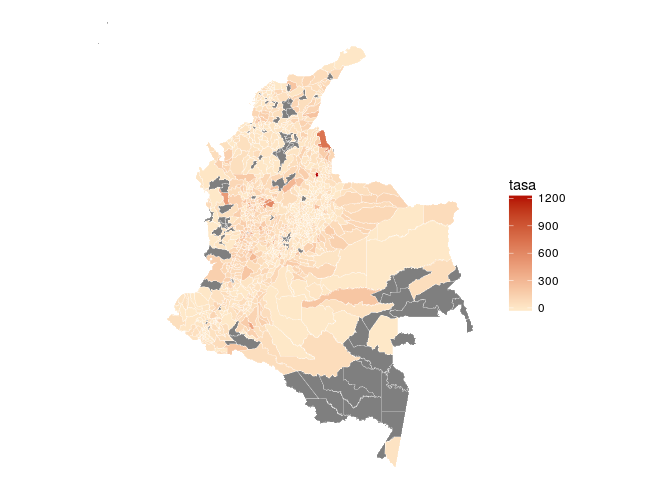
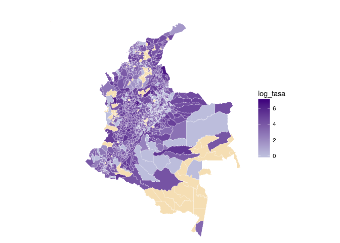
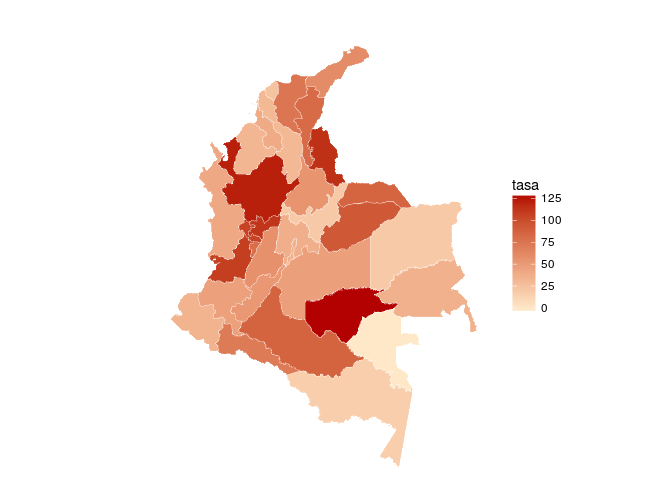
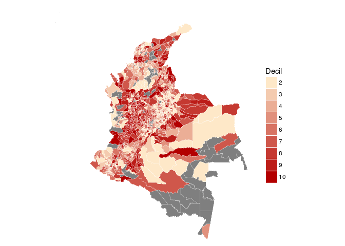
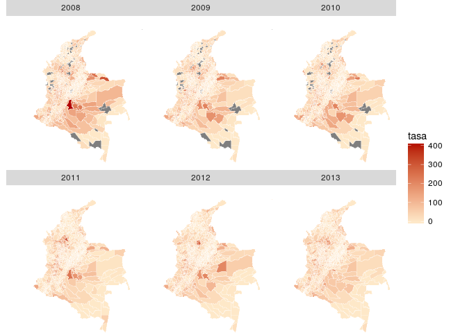

<!-- README.md is generated from README.rmd. Please edit that file -->
colmaps
=======

colmaps - colombian maps or color maps (your choice) - is an R package with current boundaries data of Colombia plus a minimal [`ggplot2::geom_map()`](http://docs.ggplot2.org/current/geom_map.html) wrapper to make [choropleth maps](https://en.wikipedia.org/wiki/Choropleth_map) with selected default color scales.

### Installation

You can install colmaps from GitHub with [`devtools`](htpps://github.com/hadley/devtools):

``` r
# install.packages("devtools")
devtools::install_github("nebulae-co/colmaps")
```

### Usage

There are two `SpatialPolygonsDataFrames` provided in the package, one for municipalities and one for departments, `municipios` and `departamentos` respectively. You can see details of each at the documentation: `?municipios` `?departamentos`.

The data frame part looks like:

``` r
library("colmaps")
head(municipios@data)
```

    #>      id id_depto            municipio        depto
    #> 1 20001       20           Valledupar        Cesar
    #> 2 68217       68             Coromoro    Santander
    #> 3 68229       68               Curití    Santander
    #> 4 68235       68 El Carmen De Chucurí    Santander
    #> 5 68245       68         El Guacamayo    Santander
    #> 6 25823       25              Topaipí Cundinamarca

The wrapper around `ggplot2::geom_map()` is `colmap()`, it will take a `map` and some `data` as arguments and ggplot it with a selected color scale and a good theme for maps taken from [`ggmap::theme_nothing()`](https://github.com/dkahle/ggmap). Since it is build with ggplot it also returns a ggplot object so one can further alter the plot in ggplot idiom, note however that you need to explicitly load `ggplot2` to add further layers and modifications.

By default the id of each area will be used as a variable:

``` r
library("ggplot2")

colmap(municipios) +
  ggtitle("Colombia - Fronteras Municipales")
```



But if you have data of each geographical unit you can pass it, specifying how to relate the map and the data frame. For example, from the [`homicidios`](https://github.com/nebulae-co/homicidios) package we have historical population, homicides and homicide rates data for municipalities:

``` r
# devtools::install_github("nebulae-co/homicidios")
library("homicidios")

head(homicidios)
```

    #>      id id_depto  municipio     depto  año poblacion homicidios     tasa
    #> 1 05001       05   Medellín Antioquia 1990   1688394       3924 232.4102
    #> 2 05002       05  Abejorral Antioquia 1990     24789         33 133.1236
    #> 3 05004       05   Abriaquí Antioquia 1990      3201          5 156.2012
    #> 4 05021       05 Alejandría Antioquia 1990      4851          7 144.3001
    #> 5 05030       05      Amagá Antioquia 1990     23606         31 131.3225
    #> 6 05031       05     Amalfi Antioquia 1990     18535         25 134.8800

And we can easily plot a thematic map of the data:

``` r
colmap(municipios, subset(homicidios, año == 2000), var = "tasa")
```



Tragically (and also ironically?!) on the year 2000, the municipality of Matanza, Santander had a homicide rate of over 1200 murders per 100.000 inhabitants, which distorts the default color scale dramatically, but we can manually re-scale the variable to be mapped into the color aesthetic, for example we can plot `log(tasa + 1)` instead of `tasa` and also we can override the default color scale in ggplot idiom. We will use [`dplyr`](https://github.com/dplyr) and [the pipe operator (`%>%`)](https://github.com/smbache/magrittr) from here on to handle the data with ease:

``` r
library("ggplot2")
library("dplyr")

homicidios %>%
  filter(año == 2000) %>%
  mutate(log_tasa = log1p(tasa)) %>%
  colmap(municipios, data = ., var = "log_tasa") +
  scale_fill_continuous(low = "#bcbddc", high = "#3f007d", na.value = "wheat")
```



Lets make the same map but by department to see other arguments:

``` r
homicidios %>%
  filter(año == 2000) %>%
  group_by(id_depto) %>%
  summarise(tasa = 10^5 * sum(homicidios, na.rm = TRUE) /
                          sum(poblacion, na.rm = TRUE)) %>%
  colmap(departamentos, data = ., data_id = "id_depto")
```



Here we note two things, `var` by default is the first non `data_id` column present on data so we may ommit the argument. Second we use `data_id` to specify the key by which the map is to be joined.

#### Color scales

The color scales depend on the class of the variable the map is being colored by:

-   For numeric data it is a continous scale with lower limit set on `"#fee8c8"` and high limit on `"#b30000"`:

    ``` r
    ggplot2::scale_fill_continuous(low = "#fee8c8", high = "#b30000")
    ```

    These were taken from the limits of the three sequential category multi-hue red pallete sugested in <http://colorbrewer2.org/>.

-   For factors with less than 10 levels the color scale used is:

    ``` r
    ggplot2::scale_fill_brewer(type = "qual", palette = "Set1")`
    ```

-   For factors with `n => 10` levels the color scale used is:

    ``` r
    ggplot2::scale_fill_manual(values = rainbow(n = n, v = 0.3 * sin(seq_len(n)) + 0.7))
    ```

    Which was designed by [Julian](https://github.com/CruzJulian) (in his own way).

-   For ordered factors a manual scale that defines a discrete version of the numeric scale is used, defined as:

    ``` r
    ggplot2::scale_fill_manual(values = colorRampPalette(c("#fee8c8", "#b30000"))(n))
    ```

    Where `n` is the number of levels of the factor.

-   Finally integer data uses the ordered factor scale for less than 20 different values and the numeric scale otherwise.

-   In all cases the default color for missing (`NA`) data is `"grey50"` which is the default ggplot2 has for `scale_fill_continous()`. Note that it can be changed with the scale as shown in the third map.

We have already seen numeric data and factors (with more than ten levels in the first plot). To ilustrate ordered factors we will make again the homicides map by municipality but first transforming the homicide rate to an ordered factor defining groups by deciles:

``` r
homicidios %>%
  filter(año == 2000) %>%
  mutate(tasa = round(tasa, 2),
         Tasa = cut(x = tasa,
                     breaks = c("0%" = -Inf,
                                quantile(tasa, seq(0.1, 1, 0.1), na.rm = TRUE)),
                     ordered_result = TRUE,
                     dig.lab = 6)) %>%
  colmap(municipios, data = ., var = "Tasa")
```



Using ggplot2
-------------

As shown above, with ggplot, you can add components (e.g. `ggtitle`) to the plot or alter them (e.g. `scale_fill_*`). A nice example of this is facetting. Here we use the year (`año`) variable passed in `data` to make a grid of plots, trellis style: one per level of the variable - in this case one per year, from 2008 to 2013.

``` r
gg <- homicidios %>%
  filter(año >= 2008) %>%
  colmap(municipios, data = ., var = "tasa")

gg + facet_wrap(~ año, nrow = 2)
```



(It is encouraging to see how this particular map has been getting somewhat paler with time.)

About
-----

This is the result of a sub-project [we](https://github.com/nebulae-co) started with various goals:

-   [learn how to make R packages](http://r-pkgs.had.co.nz/) (in particular data packages) and improving our [`git`](https://git-scm.com/) skills.
-   distribute [some](https://github.com/nebulae-co/homicidios) [data](https://github.com/nebulae-co/saber) we think should be easier to access in a simple way - of course this is mainly targeted for R users, including ourselves.
-   enable us to do some map visualizations in a simpler way. We used this data to prepare the vignette: [*Un micro-mapa de Colombia*](http://nebulae-co.github.io/colmaps/micromapa) which shows an example of a [linked micromap](https://www.jstatsoft.org/article/view/v063i02) with colombian data. That vizualisaton was presented in a random academic event.
