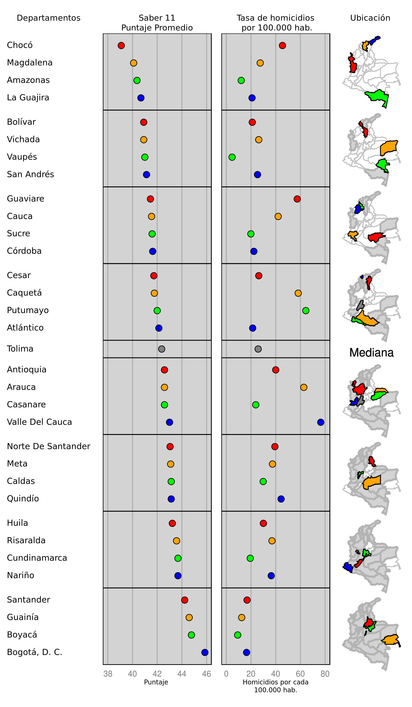

```{r setup, include = FALSE, message = FALSE}
library("colmaps")
library("homicidios")
library("saber")
library("dplyr")
library("micromap")

library("knitr")

opts_chunk$set(# echo = FALSE,
               # results = "hide",
               fig.align = "center",
               fig.path = "Figures",
               warning = FALSE, 
               message = FALSE)
```

# Introducción

Un micro-mapa es una representación gráfica de estadísticas resumen de una o más
variables de interés, agregadas a nivel de unidades geográficas, que permite
visualizar la relación entre variables y su distribución espacial.

En esta viñeta mostramos como crear un micro-mapa de Colombia a nivel
departamental a partir de la información geográfica proporcionada en el paquete
`colmaps` con datos de tasas de homicidios (del paquete `homicidios`) y datos de
las pruebas Saber 11 disponibles en el paquete `saber`.

# Obtener los paquetes:

Primero es necesario instalar el paquete `devtools` para instalar los paquetes
con los datos desde GitHub y cargarlos:

```{r instalacion, eval = FALSE}
install.packages("devtools")

devtools::install_github("nebulae-co/colmaps")
devtools::install_github("nebulae-co/homicidios")
devtools::install_github("nebulae-co/saber")
```

# Datos

Ahora podemos preparar los datos para generar el micro-mapa. Como los últimos datos disponibles de homicidios corresponden al año 2013 utilizaremos datos solamente de este año para generar el micro-mapa. Por simplicidad utilizaremos `dplyr` para organizar los datos.

Primero cargamos los paquetes:

```{r datos, cache = TRUE}
require("colmaps")
require("homicidios")
require("saber")
require("dplyr")

# Organizamos los datos de tasa de homicidio 2013 por departamento:
homicidios_2013 <- homicidios %>%
  filter(año == 2013) %>% 
  group_by(id_depto) %>%
  summarise(poblacion = sum(poblacion, na.rm = TRUE),
            homicidios = sum(homicidios, na.rm = TRUE)) %>%
  mutate(tasa_homicidios = 100000 * homicidios / poblacion) %>%
  inner_join(departamentos@data, c("id_depto" = "id"))

homicidios_2013

# Organizamos los datos de las pruebas saber 11 del año 2013
data(SB11_20131)
data(SB11_20132)

SB11_2013 <- bind_rows(
  SB11_20131 %>% 
    select(ESTU_CODIGO_RESIDE_MCPIO, ends_with("PUNT"), -COMP_FLEX_PUNT),
  SB11_20132 %>%
    select(ESTU_CODIGO_RESIDE_MCPIO, ends_with("PUNT"), -COMP_FLEX_PUNT)
  ) %>%
  mutate(id_depto = substr(formatC(ESTU_CODIGO_RESIDE_MCPIO, width = 5, flag = "0"),
                            1, 2),
         total = (3 * LENGUAJE_PUNT +
                  3 * MATEMATICAS_PUNT + 
                  3 * CIENCIAS_SOCIALES_PUNT + 
                  3 * FILOSOFIA_PUNT + 
                  3 * BIOLOGIA_PUNT + 
                  3 * QUIMICA_PUNT + 
                  3 * FISICA_PUNT + 
                  INGLES_PUNT) / 22) %>%
  group_by(id_depto) %>%
  summarise(promedio_saber = median(total, na.rm = TRUE))

# Obtenemos un solo data frame:
colombia <- inner_join(homicidios_2013, SB11_2013) %>%
  select(id_depto, depto, everything()) %>%
  mutate(depto = ifelse(id_depto == "88", "San Andrés", depto)) %>%
  as.data.frame()

head(colombia)
```

# Micromapa

```{r colombia}
require("micromap")

deptos_map <- create_map_table(departamentos, 'id') %>%
  mutate(ID = as.character(ID))

rm(list = setdiff(ls(), c("colombia", "deptos_map")))

# lmplot(stat.data = colombia,
#        map.data = deptos_map,
#        panel.types = c('labels', 'dot', 'dot', 'map'),
#        panel.data = list('depto','promedio_saber','tasa_homicidios', NA),
#        ord.by = 'promedio_saber',
#        grouping = 4, median.row=TRUE,
#        map.link = c("id_depto", 'ID'))

mmplot(stat.data = colombia,
       map.data = deptos_map,
       panel.types = c('labels', 'dot', 'dot', 'map'),
       panel.data = list('depto', 'promedio_saber', 'tasa_homicidios', NA),
       ord.by = 'promedio_saber',
       grouping = 4,
       median.row = TRUE,
       median.text.label = "Mediana",
       map.link = c("id_depto", "ID"),
       plot.height = 12,							
       colors = c('red', 'orange', 'green', 'blue', 'purple'), 
       map.color2 = 'lightgray',
       panel.att = list(list(1, header = 'Departamentos', panel.width = .8, 
                             align = 'left', text.size=.9),
                      list(2, header = 'Saber 11\nPuntaje Promedio',
                           graph.bgcolor = 'lightgray', point.size = 1.5,
                           xaxis.ticks = list(38, 40, 42, 44, 46),
                           xaxis.labels = list(38, 40, 42, 44, 46),
                           xaxis.title = 'Puntaje'),
                      list(3, header = 'Tasa de homicidios\n por 100.000 hab.',
                           graph.bgcolor = 'lightgray', point.size = 1.5,
                           xaxis.ticks = list(0, 20, 40, 60, 80),
                           xaxis.labels = list(0, 20, 40, 60, 80),
                           xaxis.title = 'Homicidios por cada\n100.000 hab.'),
                      list(4, header='Ubicación',
                           inactive.border.color = gray(.7),
                           inactive.border.size = 2,
                           panel.width=.6)),
       print.file = "micromapa.png",
       print.res = 300)
```

